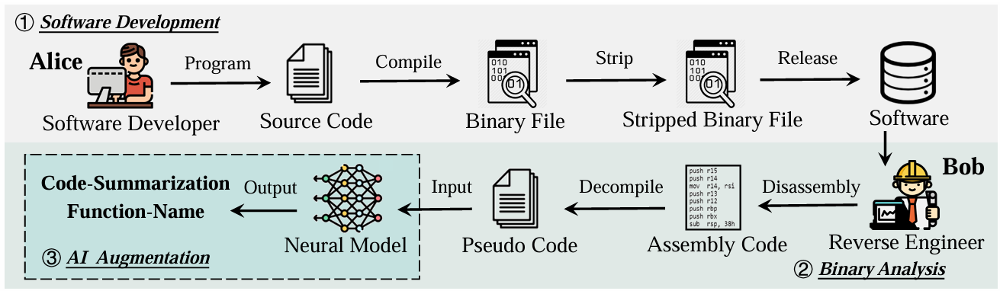
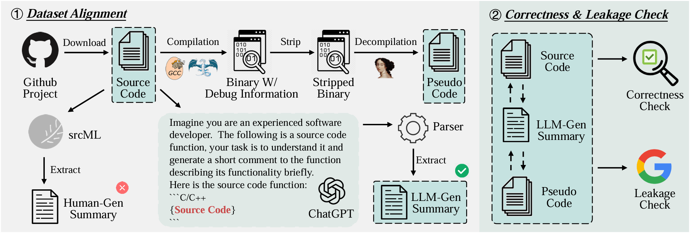
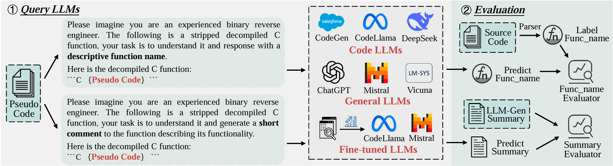

# BinaryLLMs-Eval

## 📙An Empirical Study on the Effectiveness of Large Language Models for Binary Code Understanding

<div align="center">
<p> 
<!--   <a href="https://arxiv.org/pdf/2505.04254"></a> -->
  <a href="https://arxiv.org/abs/2504.21803"></a>
</p> 
</div>

## ✒️Workflow

- ***Figure 1:*** Application background of binary code understanding.
<p align="center"></p>

- ***Figure 2:*** An overview of the benchmark dataset construction process.
<p align="center"></p>

- ***Figure 3:*** An overview of the evaluation process.
<p align="center"></p>

More details can be found in our [paper](https://arxiv.org/pdf/2504.21803).

## 🚀Environment Setup
```python
conda create -n binaryllmEval python=3.8.0
conda activate binaryllmEval
pip install -r requirements.txt
```
## 🔥Quick Start

### Inference

We provide here scripts to infer locally deployed LLMs and call ChatGPT via API.

`CUDA_VISIBLE_DEVICES=0 python infer_llama.py`

The evaluation data is in the **dataset** folder, and the specific prompts are provided in the **utils.py** file.

### Evaluation

Calculate the **Precision, Recall, and F1-score** metrics of **function name recovery** task

`python cal_funcname_metrics.py`

Calculate the **BLEU-4, METEOR, and Rouge-L** metrics of **binary code summarization** task

`python cal_summarization_metrics.py`

## 📜Citation
```
@article{shang2025empirical,
  title={An Empirical Study on the Effectiveness of Large Language Models for Binary Code Understanding},
  author={Shang, Xiuwei and Fu, Zhenkan and Cheng, Shaoyin and Chen, Guoqiang and Li, Gangyang and Hu, Li and Zhang, Weiming and Yu, Nenghai},
  journal={arXiv preprint arXiv:2504.21803},
  year={2025}
}
```
